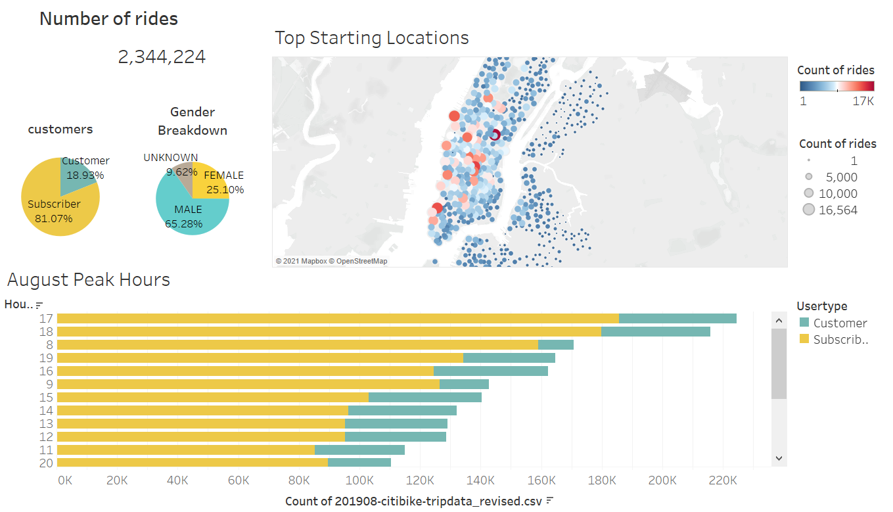
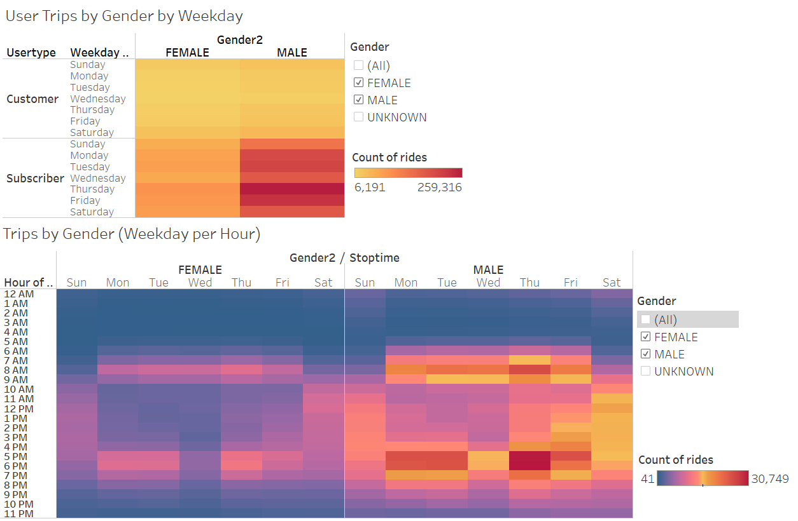
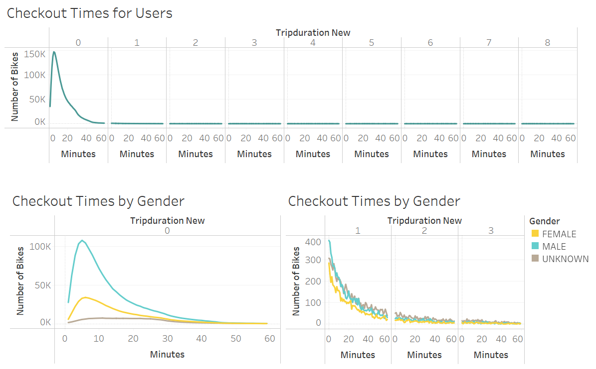

# Bikesharing

## Project Overview
The purpose of the project is to evaluate the business idea of bike-sharing program in Des Moines by analyzing CitiBike dataset in New York city using Tableau. Showcasing the visualizations to solidify this business proposal and convince potential investors for funding.
## Resources
- Data Source: 201908-citibike-tripdata.csv
- Software: Python 3.8.8, jupyter notebook 6.3.0, Tableau Public 2021.3

## Results

#### Deployed Tableau Analysis
[Link to dash dashboard](https://public.tableau.com/app/profile/bess4573/viz/NYC_citibike_challenge_16331455434320/NYCbike?publish=yes)
#### Summary of dataset

- There were over 2.3 millions of rides in Aug. 2019
- 81% of customers were subscriber, 65% of customers were male and 25% of customers were female.
- Top starting locations which were marked in red were in Manhattan mostly.
- The peak hours of the rides were happened around 16pm to 19pm and 8am to 9am.

#### Trips by weekday and gender

- Most rides in weekday were around 8am to 9am and 5pm to 6pm
- Most rides in weekend were from 10 am to 7pm

#### Checkout time analysis

- Bikes were mostly checked out within an hour
- The highest checkout time were around 5 minutes.
- In the highest point, male users (108,087) have 3 times more rides than female users(34,151).

## Summary
Overall, according to the information above, we could expect that the man who lives in the intensive city and needs to deal with the rush hour traffic may have high demand of biking-sharing. However, determining a business program can't just rely on one-month data. Here are some suggestions for future analysis: 

1. Comparing the data from different months and years.
2. Adding the weather data to analyze the relation of weather and rides.
3. Knowing the distribution of bike road in city map, it is possible that people unwilling to ride because they may feel danger if there is no bike road in city.
4. Estimating the cost, such as purchasing the bikes, maintenance fee, employees salary, developing fee for bike-sharing app, etc.
